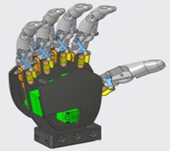
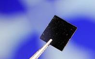
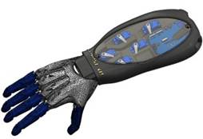
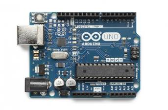

# Manipulator-based-on-graphene-sensor
Manipulator based on graphene sensor

**一、立项背景**

 

**（一）机械臂控制**

我们所研究的机械臂控制偏向仿生机械。仿生机械是通过研究和探讨生物机制, 仿照生物外形、结构或者功能而设计改进的机械。现代科学技术的高速发展一方面促进了机械这门古老学科的发展, 另一方面也对机械的结构以及性能提出了更为严苛的要求。与此同时，人们注意到，自然界在亿万年的演化过程中孕育了各种各样拥有神奇特性和功能的生物，它们具有对自然界及其规律高度的适应性。于是，人们开始模仿生物的形态、结构等来设计效率更高并具有生物特征的机械。[1]

 

 

 

 

 

 

 

 

|      |                                                |
| ---- | ---------------------------------------------- |
|      |  |

 

 

仿生机械臂控制涉及生物学、机械工程、控制论和电子技术等多门学科。涉及学科种类多，学科交叉程度深，研究困难较大。

机械臂控制可以广泛应用到危险行业，降低工作风险。例如军事排雷，太空作业等高风险领域。协助人类完成许多单调、频繁、重复的长间作业或是危险、恶劣环境下的作业，例如冲压、压力铸造、热处理、焊接、涂装、塑料制品成形、机械加工和简单装配等工序，以及在原子能工业等部门中, 搬运对人体有害的放射性物质。在这方面, 日本一直处于领先地位，其中颇具代表性的如川崎重工的工业机器人。[1]

**（二）石墨烯传感器**

利用压阻效应，通过电阻变化，可以较为精确的控制机械臂。石墨烯传感器也可以应用在体育训练，例如通过在球拍中安装传感器，辅助运动员调整动作。亦可应用在卫星等航天器上，通过电流变化，可以精确地分析航天器表面受损情况。

 

 

 

|      |                                                    |
| ---- | -------------------------------------------------- |
|      |  |

 

**二、项目研究内容及实施方案**

 

**（一）项目研究内容**

仿生机械手实验模型分为机械结构体和姿势感知与跟随动作控制电路两部分，其中机械结构体设计参考人体手臂、手掌、手指等关节按１∶１比例进行３Ｄ建模、打印和组装。控制电路涉及人体手指弯曲度、手臂转向和手掌姿势感知、实验模型实时跟随动作控制等仿生机械手实验模型机械结构体主要分为手臂、手掌和手指的设计，各关节设计不仅要考虑外观与人体相似，还要实现实时相似的动作跟随。[2-3]包括控制程序设计和传感器的制备。

**（二）实施方案**

**1.****机械臂设计**

利用solidedge st10、Zbrush软件进行3D建模，设计出机械臂的内部结构和仿生外形。利用五个舵机精确控制五根机械手指，再利用两个舵机分别控制机械臂手腕和机械肘。 

通过自制的石墨烯传感器控制手指运动，在手腕处和手肘处安装陀螺仪以感应手部变化。

手臂设计部分：考虑到美观性和手臂尺寸等问题，需要在手臂内部设计存放槽用来安装实现手臂和手指独立跟随动作的5个高精度舵机，为防止舵机抖动引起的松动和误操作等问题，设计了螺丝孔，依靠螺丝加固舵机。

手掌设计部分：手指的动作主要通过手臂里的高精度舵机拉动连动绳索实现，绳索从手指穿过手掌后进入手臂内部与相应的舵机进行连接，因此手掌顶部和侧边与手指连接处分别设计穿线孔，手掌中部和底部依照绳索走势分别设计独立的导向槽，以确保绳索拉伸顺畅和互不干扰。

 

 

 

 

|      |                        |
| ---- | ---------------------- |
|      | 图3     机械臂内部结构 |

 

手指设计部分：手指由三个关节组成，每个关节内部设计了一个小柱给绳索提供拉伸受力点。手指内部设计了两个穿线孔，其中一个为运动线穿孔，另一个为带有弹性还原线孔。每个手指的关节由特定的零部件进行连接，实现手指部分的组成[4]。

**2.****单片机程序设计**

（1）通过石墨烯传感器的应变检测功能，将机械臂变化数值转变为电压分量传输给Arduino单片机； 

（2）Arduino单片机将控制逻辑信号通过无线设备给接收模块；

（3）接收信号模块也使用Arduino单片机和无线设备，实现控制逻辑到舵机的电控驱动。

（4）通过Arduino单片机和无线设备实现多个机械臂的同步控制。

 

 

 

 

 

 

|      |                                                      |
| ---- | ---------------------------------------------------- |
|      |  |

 

 

 

**3.****传感器制作**

借助丝网印刷技术，将石墨烯、聚合物传感器材料和电阻剂按一定比例制备成传感器。并进行材料形变和电阻变化测试，以求达到形变前后2：1的电阻比。并且实现电阻比的稳定。

**4.****实验模型调试**

实验模型调试主要是检测机械手是否实现跟随穿戴式控制器的动作，检测过程中需人体戴上穿戴式控制器做出单只、多只手指同时弯曲和手臂旋转、摆动等动作，通过观察仿生机械手模型动作判断是否与实际动作相符。经多次、多人实操调试表明，在非剧烈运动下，机械手基本能够跟随穿戴式控制器的动作，同时也反映了机械手模型部分设计不合理、舵机掉电失去力矩导致机械手臂跌落、穿戴式控制器手指弯曲度感知机械设计过于粗犷、穿戴式控制器外壳欠缺服帖化等问题。

 

**三、进度安排**

 

前期利用Solidedge st10 完成机械臂的3D建模，并逐步开始Arduino单片机的控制程序设计。

中期利用Zbrush完善机械臂外形设计，完成Arduino单片机的程序设计，并开始传感器制作。

结期完善Arduino单片机控制程序，并完成传感器制作。

 

**四、中期及结期目标**

 

**（一）中期目标**

完成机械臂3D建模，并通过3D打印制作机械臂以及实现手臂中电机的合理装配。同时开始通过丝网印刷技术制备传感器。

**（二）结期目标**

通过can总线、Arduino单片机和无线设备实现机械臂的同步控制，完成传感器的制备。

 

**五、经费使用计划**

 

预算3000元

材料费，3D打印丝，主板，单片机。

 

参考文献

 

[1]叶成彬，林浩涛，STC15W的仿生机械手与穿戴式控制器设计[J].新器件新技术2020.6

[2]张涛，郑丽英，黄厚志等，人体体感感知机械手设计与实现[J].电子制作，2019（13）：18—19.

[3]孟令达，方俊杰，周雨。无线体感仿生机械手[J].物联网技术，2017.7（7）：12—13.

[4]林焕辉，陈德为。基于力反馈数据手套控制的仿生机械手设计研究[J].机电技术，2018（1）：7—9.
